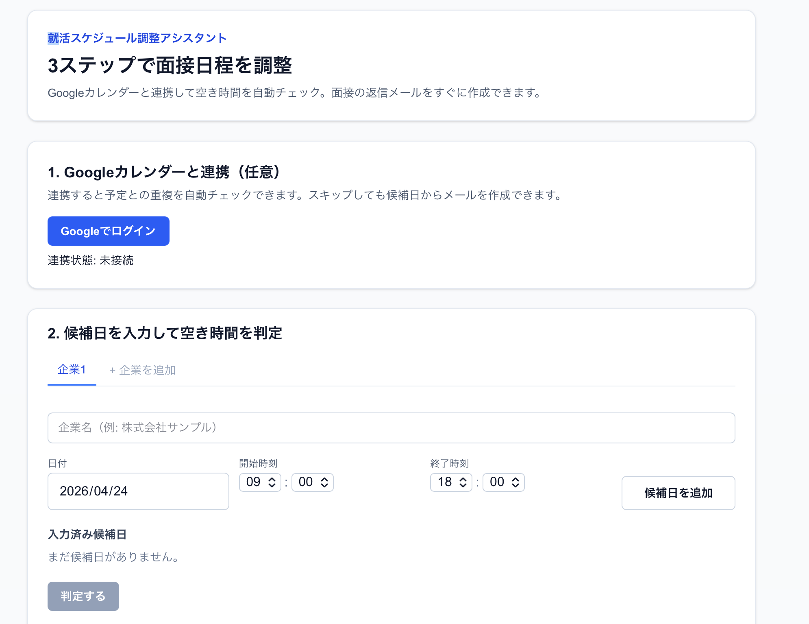
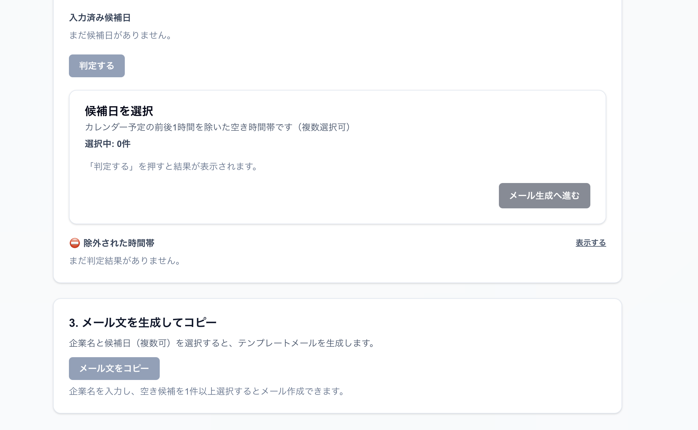
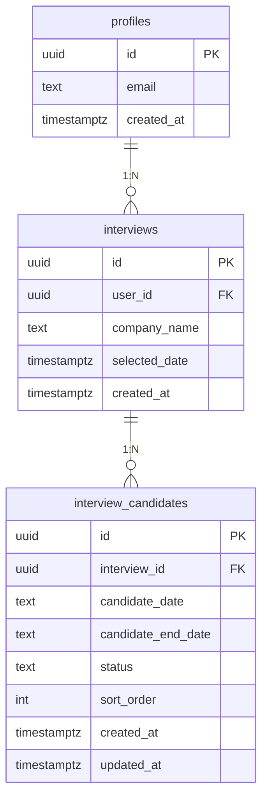
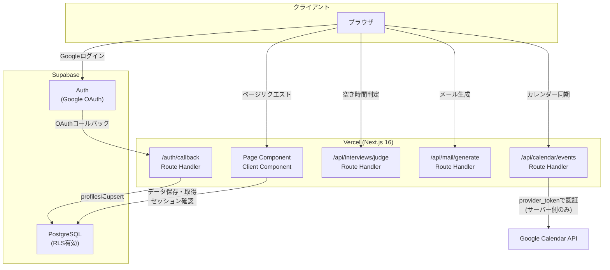

# 就活スケジュール調整アシスタント

> Googleカレンダーと連携して面接の空き時間を自動チェック。返信メールを3ステップで素早く作成できる就活生向けツール。

---

## スクリーンショット

  | 画像1| 画像2 |                                                                
  |---|---|
  |  |  |  

## URL

🔗 **サービス**: [https://job-schedule-assistant-yukis-projects-4e18f76e.vercel.app/?code=f96e572e-0089-469c-a3a0-366a4f65675f](https://job-schedule-assistant-yukis-projects-4e18f76e.vercel.app/?code=f96e572e-0089-469c-a3a0-366a4f65675f)

---

## 概要

就活スケジュール調整アシスタントは、面接の日程調整メールを素早く作成するためのWebアプリです。

Googleカレンダーと連携することで既存の予定との重複を自動チェックし、複数企業の候補日を管理しながら返信メールを3ステップで作成できます。ログインなしでもすぐに使い始められます。

## 開発背景

就職活動中、面接の日程調整メールを作成するたびにカレンダーを開いて空き時間を確認し、複数の候補日を手動でメールに書き出す作業に手間を感じていました。

「カレンダーとの照合から返信メールの作成まで一気通貫でできるツールが欲しい」という自分自身の課題感から開発しました。

## 機能一覧

| 機能 | 説明 |
|---|---|
| Googleカレンダー連携 | Googleアカウントでログインし、今後3週間のカレンダー予定をサーバー側で取得 |
| 空き時間の自動判定 | 予定の前後1時間をバッファとして除外し、候補日の空き時間帯を算出 |
| 複数企業の管理 | タブUIで複数企業の候補日を独立して管理。企業の追加・削除に対応 |
| おすすめ時間帯の表示 | 最も早い空き時間帯に「おすすめ」バッジを自動表示 |
| メール文の生成・編集 | 選択した時間帯からメールテンプレートを自動生成。テキストの自由編集にも対応 |
| Gmail連携 | 生成したメールをそのままGmail作成画面で開ける |
| ログインなし対応 | Googleアカウント未連携でも候補日の入力・メール生成が可能 |
| データの永続化 | ログイン時はSupabase DBに保存（複数デバイス対応）、未ログイン時はlocalStorageに保存 |

## 画面説明

### Step 1. Googleカレンダーと連携

Googleアカウントでログインし「Googleカレンダーを同期」ボタンを押すことで、今後3週間の予定を取得します。ログインせずにスキップすることも可能です。

### Step 2. 候補日を入力して空き時間を判定

企業名と候補日時（日付・開始時刻・終了時刻）を入力し「判定する」を押すと、カレンダーの予定と照合して空き時間帯が一覧表示されます。複数企業をタブで切り替えながら管理できます。

### Step 3. メール文を生成してコピー

空き時間帯にチェックを入れ「メール生成へ進む」を押すと、返信メールのテンプレートが自動生成されます。テキストを編集後、コピーボタンまたはGmail作成画面を開くボタンで送信できます。

## 使用技術

### フロントエンド

| 技術 | バージョン | 用途 |
|---|---|---|
| Next.js | 16.2.4 | App Router / Route Handlers |
| React | 19.2.4 | UIコンポーネント |
| TypeScript | 5 | 型安全な実装 |
| Tailwind CSS | 4 | スタイリング |
| Radix UI | 1.3.3 | アクセシブルなUIプリミティブ |

### バックエンド・インフラ

| 技術 | 用途 |
|---|---|
| Supabase Auth | Google OAuthによる認証 |
| Supabase PostgreSQL | ユーザーデータの永続化（RLSで行レベルセキュリティを適用） |
| Google Calendar API v3 | カレンダー予定の取得（サーバー側Route Handlerで実行） |
| Vercel | ホスティング・デプロイ |

### テスト・開発ツール

| 技術 | バージョン | 用途 |
|---|---|---|
| Vitest | 4.1.5 | ユニットテスト |
| Testing Library | 16 | Reactフックのテスト |
| happy-dom | 20 | テスト用DOMエミュレーション |

## ER図

## インフラ構成図

## 今後の展望

- [ ] 確定した面接日をGoogleカレンダーへ自動登録
- [ ] 選考状況のダッシュボード表示
- [ ] 複数デバイス間のリアルタイム同期（Supabase Realtime）
