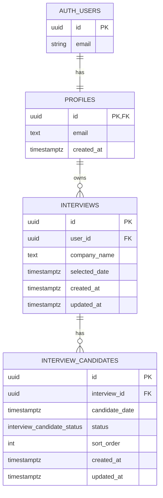

# DB設計（ER図レベル）

対象: 就活スケジュール自動調整アプリ（MVP + 拡張余地）

## 1. ER図（Mermaid）

---

## 2. テーブル定義

## `profiles`
- **目的**: 認証ユーザーの最小プロフィール
- **PK**: `id` (`auth.users.id` と同一)
- **カラム**
  - `id uuid not null primary key`
  - `email text not null`
  - `created_at timestamptz not null default now()`

## `interviews`
- **目的**: 企業ごとの面接調整単位
- **PK**: `id`
- **FK**: `user_id -> profiles.id`
- **カラム**
  - `id uuid not null primary key default gen_random_uuid()`
  - `user_id uuid not null references profiles(id) on delete cascade`
  - `company_name text not null`
  - `selected_date timestamptz null`
  - `created_at timestamptz not null default now()`
  - `updated_at timestamptz not null default now()`

## `interview_candidates`
- **目的**: 候補日時を1行1候補で保持
- **PK**: `id`
- **FK**: `interview_id -> interviews.id`
- **カラム**
  - `id uuid not null primary key default gen_random_uuid()`
  - `interview_id uuid not null references interviews(id) on delete cascade`
  - `candidate_date timestamptz not null`
  - `status interview_candidate_status not null default 'pending'`
  - `sort_order int not null default 0`
  - `created_at timestamptz not null default now()`
  - `updated_at timestamptz not null default now()`

---

## 3. 制約

- `interview_candidates.status` はEnum型で管理
  - `interview_candidate_status = ('pending', 'rejected', 'selected')`
- 同一面接に同一日時を重複登録しない
  - `unique (interview_id, candidate_date)`
- 並び順重複を避ける場合は
  - `unique (interview_id, sort_order)`（運用で必要なら追加）

---

## 4. 推奨インデックス

- `interviews (user_id, created_at desc)`
  - ユーザーごとの面接一覧表示を高速化
- `interview_candidates (interview_id, sort_order)`
  - 候補一覧の並び替え取得を高速化
- `interview_candidates (interview_id, status, candidate_date)`
  - ステータス別集計・絞り込みを高速化

---

## 5. RLS（Row Level Security）方針

Supabase前提で、`profiles / interviews / interview_candidates` にRLSを有効化する。

- `profiles`: `id = auth.uid()` のみ参照/更新可
- `interviews`: `user_id = auth.uid()` のみ参照/作成/更新/削除可
- `interview_candidates`: 親 `interviews.user_id = auth.uid()` を満たす行のみ許可

---

## 6. 将来拡張の余地

- `interview_candidates.rejected_reason text`
- `interviews.company_contact_email text`
- `interviews.mail_subject / mail_body` の履歴保持
- `calendar_sync_logs` テーブル（取得失敗解析用）

---

## 7. Enum採用メモ

- **メリット**: 不正値混入をDBレベルで防げる、API/フロントの型定義と揃えやすい
- **注意点**: 新しい状態値を追加する際はマイグレーションが必要
  - 例: `rescheduled` を追加する場合 `alter type ... add value ...`

